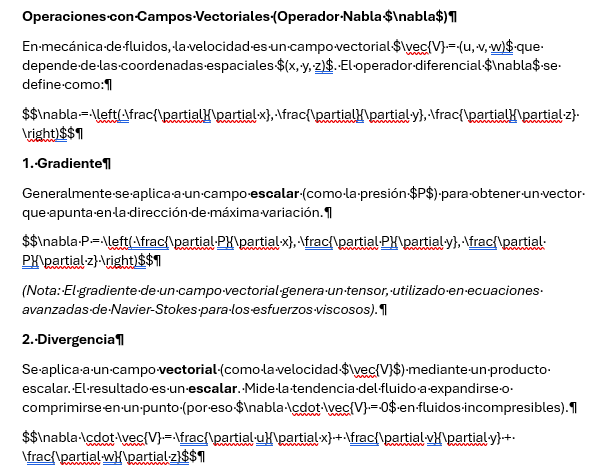
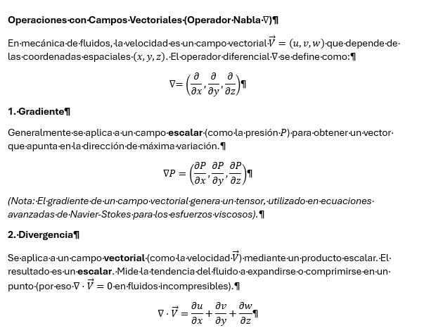

# Pasting-AI-Generated-Equations-LaTeX-to-Word-VBA-Macro-

By using this VBA macro in Microsoft Word, all LaTeX-based equations (like those copied from AI tools) enclosed in `$` or `$$` are automatically converted into professional, natively formatted Word equations.

Ideal for students, teachers, and engineers who copy AI-generated explanations or take notes in Markdown and need to export them to formal Word documents without rewriting every formula by hand.

## ✨ Features

* **Inline Equations:** Converts any formula enclosed in single dollar signs (e.g., `$E=mc^2$`) into an inline equation natively integrated into the text.
* **Block Equations:** Converts formulas enclosed in double dollar signs (e.g., `$$\nabla \cdot \vec{V} = 0$$`) into centered, standalone block equations.
* **Format Cleanup:** Automatically removes hidden line breaks and tabs inside complex formulas (like matrices) to prevent Word's math engine from crashing.
* **Safe Pair-Matching Algorithm:** Uses a strict text-isolation approach instead of Word's native wildcards, ensuring no equations are left half-rendered or merged together.

## 📸 Demo

**Before running the macro:**

**After running the macro:**

## ⚙️ Installation

To make this script permanently available in all your Word documents, follow these steps:

1. Open Microsoft Word.
2. Press `Alt + F11` to open the Visual Basic for Applications (VBA) editor.
3. In the left panel (Project Explorer), look for the folder named **Normal** or **Project (Normal)**.
4. Right-click on it, select **Insert**, and then click **Module**.
5. Copy the entire code from the `ConvertidorEcuaciones.vba` file in this repository and paste it into the blank window.
6. Click the Save icon (floppy disk) in the top left corner and close the editor.

## 🛠️ Usage

1. Write or paste your text containing LaTeX formulas into a standard Word document.
2. Ensure you use `$` for inline formulas and `$$` for block formulas.
3. Press `Alt + F8` to open the macros list.
4. Select **ConvertirEcuacionesFinal** and click **Run**.

**Pro Tip:** You can add a quick-access button for this macro by right-clicking Word's top ribbon > *Customize the Ribbon...* > select *Macros* from the left dropdown, and drag it to your toolbar.

## ⚠️ Known Limitations & Troubleshooting

Word's native equation engine (UnicodeMath) sometimes struggles to automatically compile very complex LaTeX block commands, such as `\begin{vmatrix}` or large equation systems.

If the script leaves the raw LaTeX text inside the equation box, the fix is quick:
1. Click inside the uncompiled equation.
2. Go to the **Equation** tab on the Word ribbon.
3. Select the **LaTeX** mode.
4. Click on **Convert** and choose **Professional** (or Current).

## 📄 License

This project is licensed under the MIT License.
